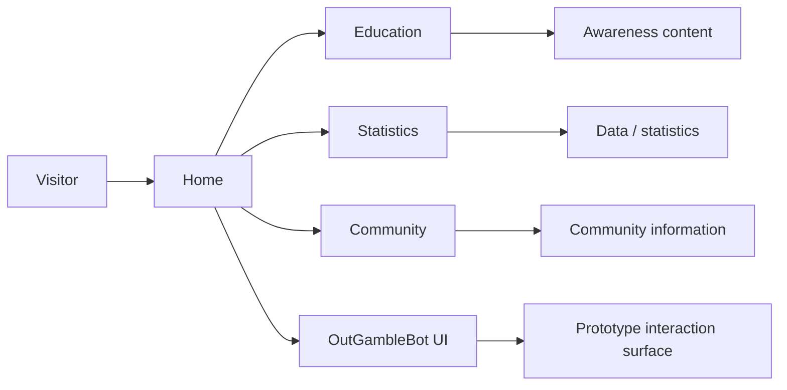
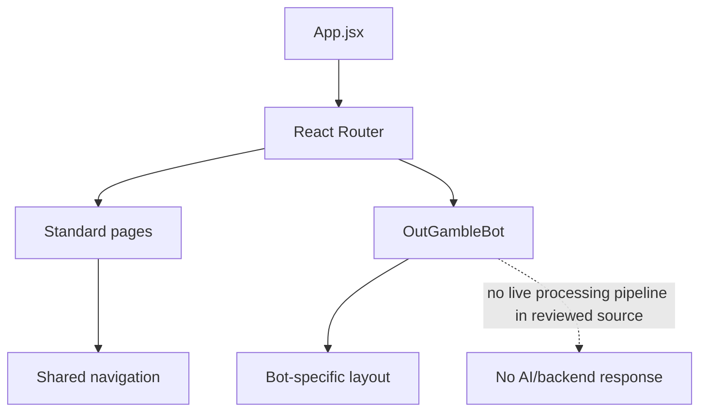
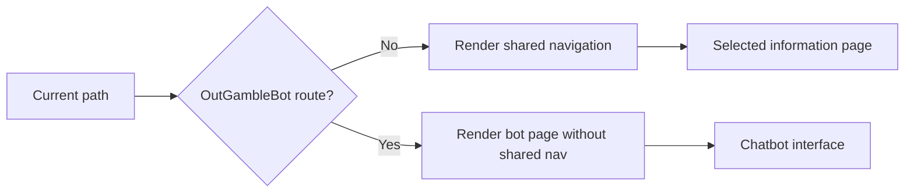
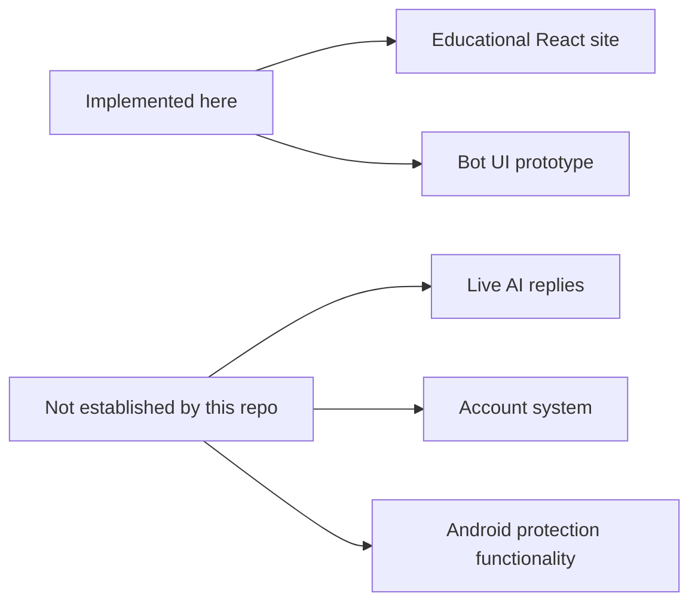
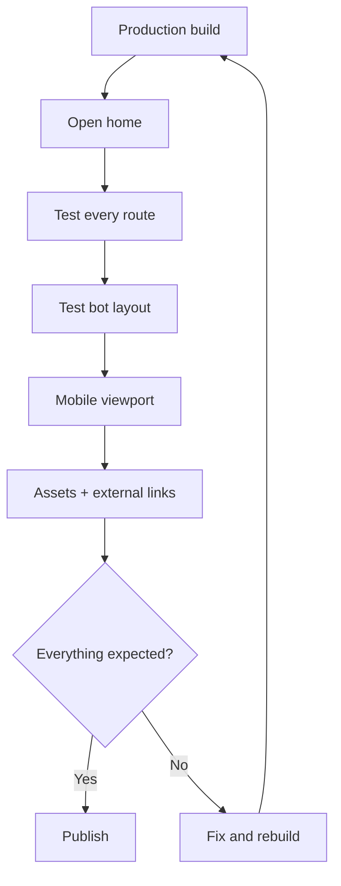

# 🛡️ OutGamble — Engineering Blueprint

> **Awareness-first web experience:** React routes for education, statistics, community content, and a chatbot-style interface prototype.

**Reviewed snapshot:** `main` @ [`07e3b9fe5fb3`](https://github.com/HidayahMF/OutGamble/commit/07e3b9fe5fb3442af9d248dece805a88120cf133) — 2026-09-17

## ⚡ Project pulse

| Area | Current implementation |
| --- | --- |
| UI | React + Vite |
| Navigation | React Router |
| Content | Frontend-owned educational pages/assets |
| Chatbot | Interface prototype only |
| Backend / DB | Not present in reviewed tree |
| CI | No `.github/workflows/` found |

## 🧭 Visitor journey

## 🏗️ Frontend architecture

## 🧩 Route behavior

## 🗺️ Code ownership map

| Source | Owns |
| --- | --- |
| [`frontend/src/App.jsx`](https://github.com/HidayahMF/OutGamble/blob/07e3b9fe5fb3442af9d248dece805a88120cf133/frontend/src/App.jsx) | Routing + shared layout |
| [`frontend/src/pages/OutGambleBot.jsx`](https://github.com/HidayahMF/OutGamble/blob/07e3b9fe5fb3442af9d248dece805a88120cf133/frontend/src/pages/OutGambleBot.jsx) | Bot-style UI prototype |
| [`frontend/src/pages/Community.jsx`](https://github.com/HidayahMF/OutGamble/blob/07e3b9fe5fb3442af9d248dece805a88120cf133/frontend/src/pages/Community.jsx) | Community information |

## 🚀 Development → release pipeline

```mermaid
flowchart LR
    A[Content / UI change] --> B[Trace route + page]
    B --> C[Implement in React]
    C --> D[Fact-check claims]
    D --> E[Accessibility check]
    E --> F[Lint]
    F --> G[Production build]
    G --> H[Direct-route smoke test]
    H --> I[PR review]
    I --> J[Static deploy]
```

### Declared frontend commands

`npm run dev` → local Vite server  
`npm run lint` → ESLint  
`npm run build` → production build

## 🛡️ Quality gates

| Gate | Pass condition |
| --- | --- |
| Routing | Every page loads correctly on direct refresh |
| Navigation | Bot route and normal pages show the intended layout |
| Accessibility | Controls have labels and keyboard support |
| Responsive UI | Narrow-screen layout remains usable |
| Content accuracy | Educational/statistical claims are checked before publication |
| Product honesty | Prototype UI is not described as a live AI service |
| Build | Production build completes successfully |

## ⚠️ Scope boundary

That separation matters: this repository demonstrates a **web educational experience**, not the full mobile/product architecture that may exist elsewhere.

## ⚠️ Risk radar

| Priority | Finding | Guardrail |
| --- | --- | --- |
| 🟠 Medium | Bot page looks interactive but has no live message pipeline | Label/document it as a prototype until backend logic exists |
| 🟠 Medium | Educational/statistical content can become stale | Re-verify claims before major releases |
| 🟡 Low | No conventional automated tests found | Use route/build/accessibility smoke checks |
| 🟡 Low | No CI workflow found | Keep release checklist explicit until automation is added |

## 🌐 Release smoke path

---

### Keeping this blueprint accurate

Update this file whenever routing, content ownership, or the chatbot implementation changes. If a backend/message processor is added later, document the real request/response path instead of extending the prototype diagram by assumption.
