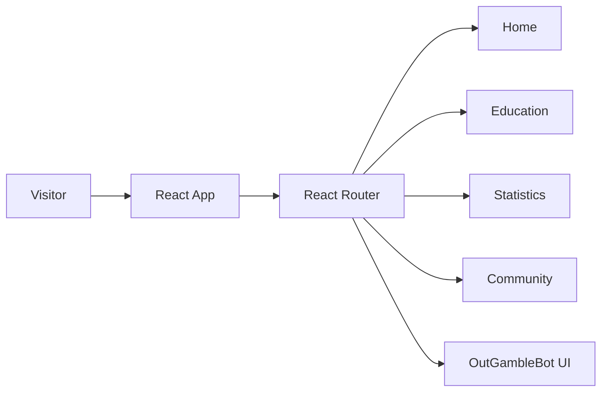
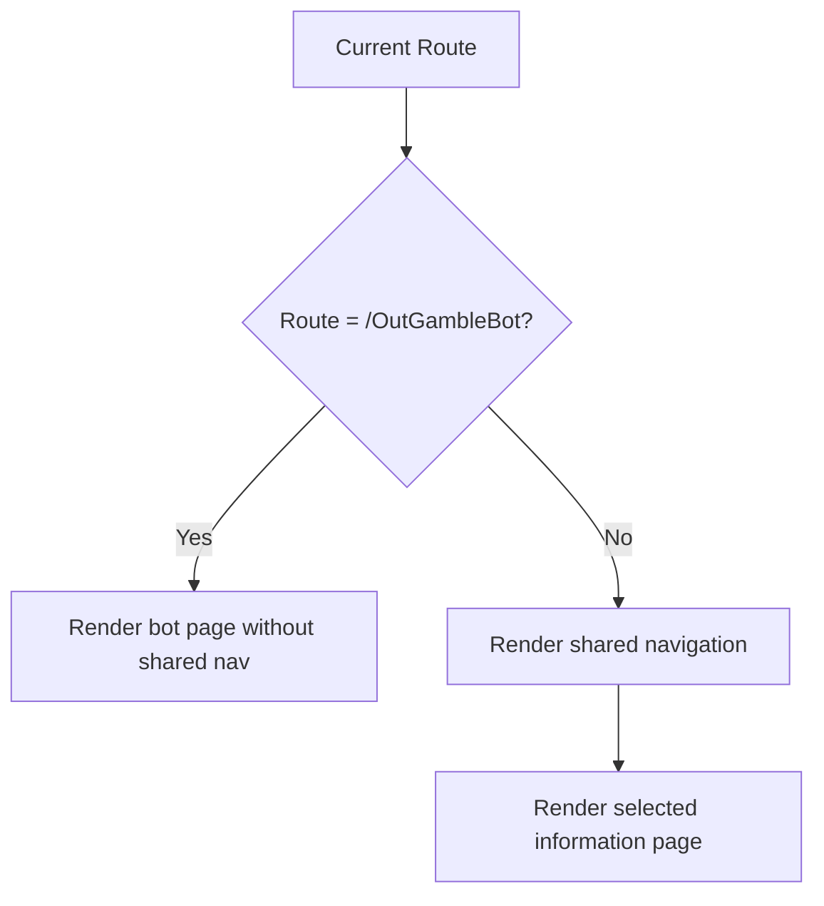
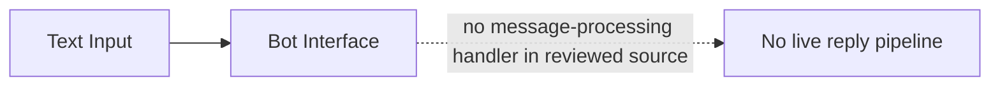
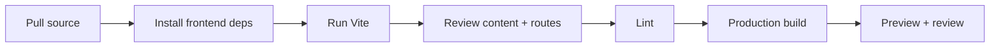
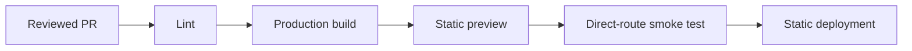
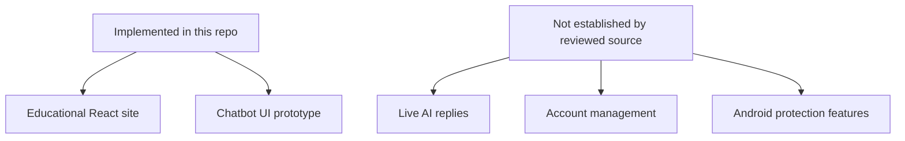

# OutGamble — Development Pipeline

> Code-grounded architecture and delivery guide for the current repository snapshot. Reviewed from `main` at `07e3b9fe5fb3` on 2026-09-17.

The current repository is a React educational website focused on awareness and prevention, with several informational routes and a chatbot interface prototype.

## 1. Frontend architecture

## 2. Route and layout flow

## 3. Chatbot status

The reviewed `OutGambleBot` component provides presentation elements but does not establish a live AI/message backend.

## 4. Runtime ownership

| Layer | Responsibility | Key source |
| --- | --- | --- |
| React app | Shared routing/layout | `frontend/src/App.jsx` |
| Bot page | Chatbot interface prototype | `frontend/src/pages/OutGambleBot.jsx` |
| Community | Community information UI | `frontend/src/pages/Community.jsx` |
| Assets/data | Educational content and visuals | Frontend source/assets |

## 5. Development pipeline

| Directory | Command | Purpose |
| --- | --- | --- |
| `frontend` | `npm run dev` | Vite development server |
| `frontend` | `npm run build` | Production frontend build |
| `frontend` | `npm run lint` | ESLint |

## 6. Verification gates

- Every route renders directly on page refresh.
- Shared navigation correctly hides/shows around the bot route.
- Back/forward navigation works.
- Forms and controls have accessible labels and keyboard behavior.
- Mobile/narrow-screen layouts remain usable.
- External links/assets resolve.
- Educational claims are independently fact-checked before publication.
- The bot UI is not described as live AI until a real processing flow exists.

## 7. Release pipeline

No backend, database, or GitHub Actions workflow was present in the reviewed snapshot.

## 8. Current scope vs future capability

## 9. Known gaps

1. No backend/database appears in the reviewed tree.
2. `OutGambleBot` is presentation-only in the inspected implementation.
3. No conventional automated test suite was found.
4. CI automation is not present under `.github/workflows/` in this snapshot.

## 10. Source map

- [`frontend/src/App.jsx`](https://github.com/HidayahMF/OutGamble/blob/07e3b9fe5fb3442af9d248dece805a88120cf133/frontend/src/App.jsx)
- [`frontend/src/pages/OutGambleBot.jsx`](https://github.com/HidayahMF/OutGamble/blob/07e3b9fe5fb3442af9d248dece805a88120cf133/frontend/src/pages/OutGambleBot.jsx)
- [`frontend/src/pages/Community.jsx`](https://github.com/HidayahMF/OutGamble/blob/07e3b9fe5fb3442af9d248dece805a88120cf133/frontend/src/pages/Community.jsx)

Keep this guide synchronized with routing, factual content, and any future backend/chatbot implementation.